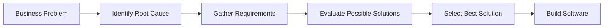

# Problem vs Solution

## Objective

Understand why software engineers focus on solving business problems before proposing software solutions.

---

## Diagram

---

## Explanation

Every software project begins with a business problem, not with technology.

A common beginner mistake is immediately deciding to build an application without fully understanding what needs to be solved.

Instead, software engineers follow a structured approach:

1. Identify the business problem.
2. Find the root cause of the problem.
3. Gather the business requirements.
4. Explore different possible solutions.
5. Choose the most appropriate solution.
6. Only then begin building software.

Software is one possible solution—not the starting point.

---

## Real-World Example

### Problem

Customers wait 20 minutes in line to pay.

### Wrong Thinking

> We need a Point of Sale (POS) system.

### Better Thinking

Why are customers waiting?

Possible causes:

- Cashiers manually calculate totals.
- Products have no barcode.
- Inventory is updated using paper records.

Now the software engineer understands the actual problem before suggesting a solution.

---

## Software Engineering Insight

Professional software engineers rarely begin by asking:

> "What should we build?"

Instead, they ask:

- What problem are we solving?
- Why does this problem exist?
- Who experiences the problem?
- How is the business affected?
- What is the best solution?

Sometimes software isn't even the correct solution.

---

## Related Topics

- Cause and Effect Thinking
- Requirement Analysis
- Business Process Analysis
- Stakeholder Analysis

---

## Key Takeaways

- Problems come before solutions.
- Software exists to solve business problems.
- Understand the business before writing code.
- Never assume software is the only solution.