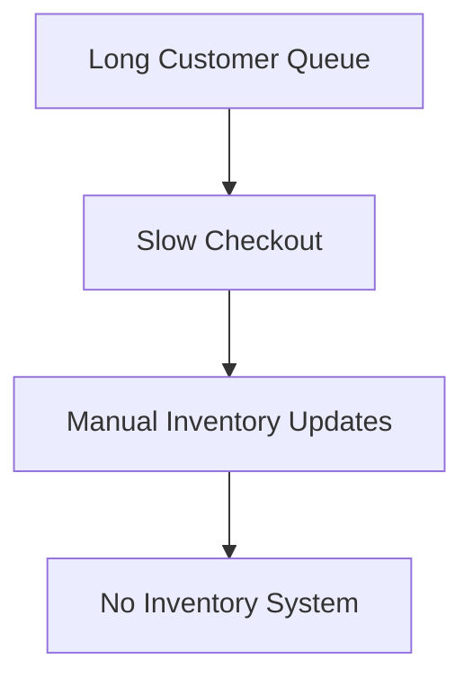

# Cause and Effect Thinking

## Objective

Learn to distinguish between symptoms and root causes when analyzing business problems.

---

## Diagram

---

## Explanation

Many business problems are only symptoms.

Software engineers continue asking **"Why?"** until they discover the real cause.

Solving symptoms often leads to temporary fixes.

Solving root causes creates long-term improvements.

---

## Real-World Example

Problem:

Customers complain about waiting.

Possible analysis:

Why?

↓

Cashiers take too long.

↓

Why?

↓

Products are entered manually.

↓

Why?

↓

There is no barcode inventory system.

The missing inventory system—not the customer complaint—is the root cause.

---

## Software Engineering Insight

Experienced engineers investigate problems instead of accepting the first explanation they hear.

---

## Related Topics

- Problem vs Solution
- Requirement Analysis
- Business Process Analysis

---

## Key Takeaways

- Symptoms are not root causes.
- Ask "Why?" repeatedly.
- Fix the underlying problem.