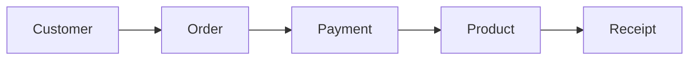

# Business Process Analysis

## Objective

Visualize how work flows through a business.

---

## Diagram

---

## Explanation

Businesses operate through processes.

Each activity produces an output that becomes the input for the next activity.

Software engineers analyze these workflows before designing software.

---

## Real-World Example

Coffee Shop

Customer

↓

Places Order

↓

Barista Prepares Drink

↓

Customer Pays

↓

Drink Served

The workflow exists even if no software is involved.

---

## Software Engineering Insight

Software should improve an existing business process—not replace the understanding of it.

---

## Related Topics

- Stakeholder Analysis
- System Thinking
- Requirement Analysis

---

## Key Takeaways

- Businesses are workflows.
- Workflows exist before software.
- Understand the process before improving it.