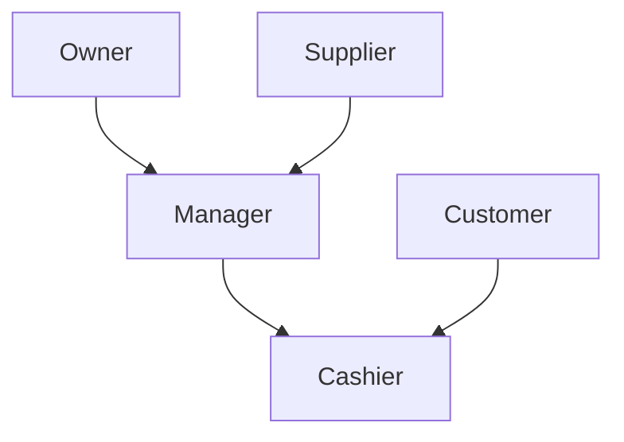

# Stakeholder Analysis

## Objective

Identify everyone who influences or is affected by a business system.

---

## Diagram

---

## Explanation

A stakeholder is anyone who affects or is affected by the business.

Not every stakeholder directly uses the software.

Understanding different stakeholder needs helps software engineers build systems that support the entire business.

---

## Real-World Example

Bakery

Owner

- Wants higher profit.

Manager

- Wants sales reports.

Cashier

- Wants fast checkout.

Customer

- Wants quick service.

Supplier

- Wants accurate purchase orders.

Each stakeholder has different goals.

---

## Software Engineering Insight

Successful software balances the needs of multiple stakeholders instead of focusing on only one user.

---

## Related Topics

- Business Process Analysis
- Requirement Analysis
- System Thinking

---

## Key Takeaways

- Every stakeholder has different goals.
- Good software considers all important stakeholders.
- Understanding people is as important as understanding technology.