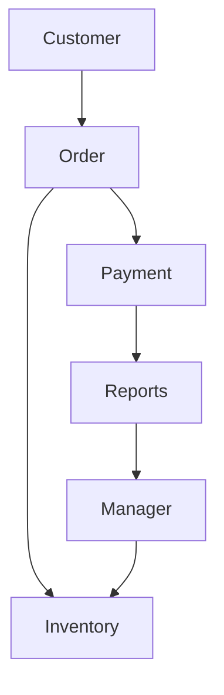

# System Thinking

## Objective

Learn to see a business as a collection of connected parts working together toward a common goal.

---

## Diagram

---

## Explanation

A system is more than a collection of independent activities.

Every action in a business affects another part of the business.

For example:

- Creating an order decreases inventory.
- Completing a payment updates sales reports.
- Reports help managers make business decisions.
- Managers decide when inventory should be restocked.

Instead of seeing isolated tasks, software engineers learn to see the relationships between them.

---

## Real-World Example

Imagine a supermarket.

A customer buys milk.

↓

Inventory decreases.

↓

Sales increase.

↓

Revenue report updates.

↓

Manager notices inventory is low.

↓

Manager orders more milk from the supplier.

One simple purchase affects multiple parts of the business.

---

## Software Engineering Insight

Software engineers design systems, not individual screens.

Every feature should be understood in terms of how it affects the entire business.

---

## Related Topics

- Business Process Analysis
- Decomposition Thinking
- Engineering Information Map

---

## Key Takeaways

- Businesses are systems.
- Every action affects another process.
- Think about relationships, not isolated features.