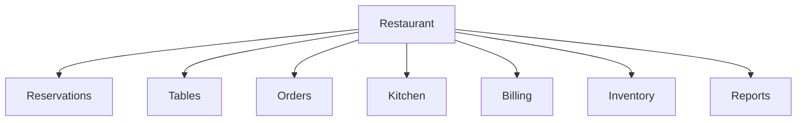

# Decomposition Thinking

## Objective

Learn how software engineers break large business problems into smaller, manageable pieces.

---

## Diagram

---

## Explanation

Large business systems can be overwhelming.

Instead of understanding everything at once, software engineers divide the business into major processes.

Each process can then be analyzed independently.

This makes complex systems easier to understand, discuss, and eventually build.

---

## Real-World Example

Instead of saying:

> Build a restaurant system.

Break it down.

- Reservation Management
- Table Management
- Order Processing
- Kitchen Operations
- Billing
- Inventory
- Reporting

Each module solves one part of the overall problem.

---

## Software Engineering Insight

Professional engineers divide complex problems before solving them.

Breaking a business into smaller pieces reduces complexity and improves understanding.

---

## Related Topics

- System Thinking
- Business Process Analysis
- Requirement Analysis

---

## Key Takeaways

- Divide large problems into smaller ones.
- Analyze one process at a time.
- Smaller problems are easier to solve.