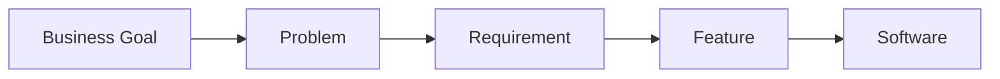

# Requirement Analysis

## Objective

Understand how business goals become software requirements and eventually software features.

---

## Diagram

---

## Explanation

Software requirements should always originate from business needs.

Instead of inventing features, software engineers first understand:

- Business goals
- Business problems
- Business requirements

Only then are software features designed.

---

## Real-World Example

Business Goal

Reduce customer waiting time.

↓

Problem

Checkout takes too long.

↓

Requirement

Cashiers should process payments faster.

↓

Feature

Barcode scanning.

Notice that the feature exists because of the requirement—not the other way around.

---

## Software Engineering Insight

Features should always solve a real business requirement.

If a feature does not solve a business problem, it probably should not exist.

---

## Related Topics

- Problem vs Solution
- Cause and Effect Thinking
- Stakeholder Analysis

---

## Key Takeaways

- Goals create requirements.
- Requirements create features.
- Features should solve real problems.