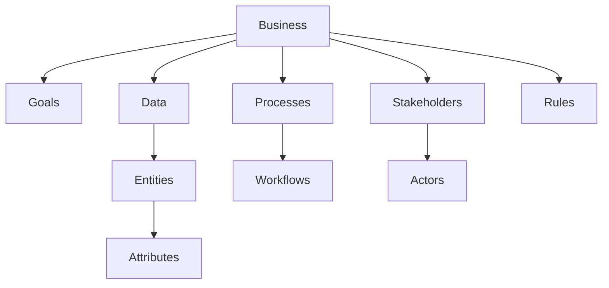

# Engineering Information Map

## Objective

Visualize how software engineers organize business knowledge before designing software.

---

## Diagram

---

## Explanation

Software engineers organize business knowledge into several core areas.

Every business can be understood by identifying:

- Goals
- Stakeholders
- Processes
- Data
- Business Rules

From there, engineers identify:

- Entities
- Attributes
- Actors
- Workflows

These become the foundation for software design.

---

## Real-World Example

Coffee Shop

Goal

Sell coffee efficiently.

Stakeholders

Customer, Barista, Manager.

Processes

Ordering, Payment, Drink Preparation.

Data

Customers, Orders, Drinks, Inventory.

Business Rules

Inventory cannot become negative.

---

## Software Engineering Insight

Before writing code, software engineers build a mental map of how the business operates.

This understanding becomes the blueprint for databases, APIs, user interfaces, and business logic.

---

## Related Topics

- System Thinking
- Requirement Analysis
- Business Process Analysis
- Stakeholder Analysis
- Decomposition Thinking

---

## Key Takeaways

- Every business has goals, people, processes, data, and rules.
- Software is built from understanding business information.
- Good software starts with a good mental model of the business.